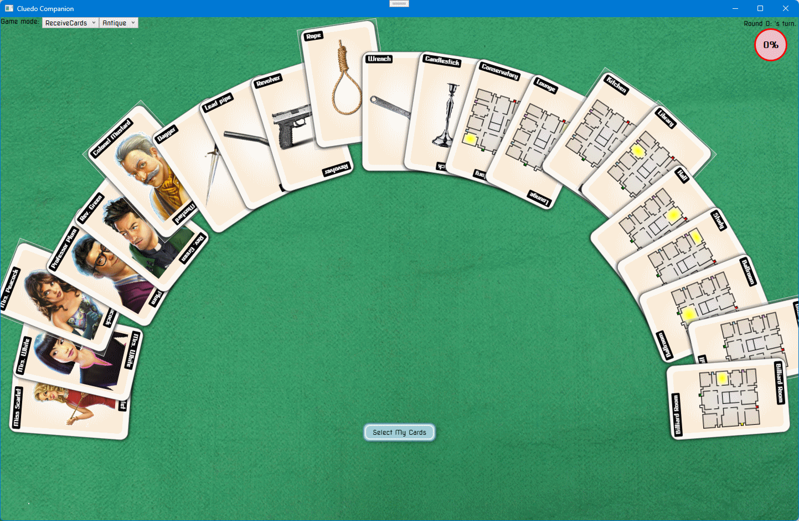

# Cluedo Companion

## Technical Design Notes
### Inspiration
I wrote this app primarily as a tool to explain to my kids why I would almost always beat them at Clue/Cluedo. 
(To be fair on them they were about 10/13 at the time :-)). It was a way to visualize how information could be derived 
from suggestions others players made, rather than focusing just on cards you were explicitly shown.

I had originally intended to play the board game with the app running on a tablet for me to make my notes
rather than using a pencil and tiny paper cards that come with the game. Alas, this was considered cheating by the family.

As with almost all my pet projects I never finished the app. Goals of remote play and AI players became less interesting 
as the family moved on to more advanced games (Settlers of Catan etc.).

The technical inspiration behind this project was to build a .NET Core WPF application. Later I also attempted to create a UWP variant
which was just an exercise in frustration, and didn't go anywhere.

### Cards
* Each card is rendered using a DataTemplate, the template is selected based on the current Theme 
(managed by the ThemeResourceDictionary). Templates are bound using DynamicResource so that we can
switch themes on the-the-fly.
* Groups of cards are displayed using an ItemsControl with the ItemTemplate set accordingly.
* ItemsControls representing a "hand" use a ItemsPanelTemplate override from the default vertical stack panel to a
custom RadialPanel. This panel allows arranging child items in a full circle or just an arc defined by a start and end angle.
```csharp
                <ItemsPanelTemplate>
                    <ctrl:RadialPanel 
                        Stretch="Fill" 
                        StartAngle="-90"
                        EndAngle="270"/>
                </ItemsPanelTemplate>
```

### Commands
* The GameCommands class defines all the commands (actions) available within the app. 
Given the simplicity of the problem set there aren't that many.
* The commands are implemented using the built-in RoutedUICommand implementation. 
* CommandBindings are defined in the code-behind on the main window. Command Execute/CanExecute logic are
mapped to methods on the Game class itself.

###  Model
* The Model folder contains models for all the game elements, including a few enumeration types. 
* The classes here are really ViewModels, they derived from an ObservableBase class for property change notification.
In addition collection properties are exposed as ObservableCollections or ICollectionViews.
* The game engine isn't limited to 6 suspects, 6 weapons and 10 locations. A harder (or easier) version of the game 
could easily be handled.

### Graphics
* Stock images are used for:
	* Suspects
	* Murder Weapons
	* Green felt backdrop
	* Magnifying glass splash/card logo
* The location cards (highlight room, player starting locations and house outline) are rendered using WPF Paths.
* Cluedo? logo uses Script MT font

> __Note:__ This app is using copyrighted names and images, as such it is for my personal use only.

## Game play

### Setup
1. The user selects how many people will be playing the game.
2. They should always make themselves the first player.
3. Enter the names of the other players, and choose the token (character) selected by each player.
4. Press "Play" to start the game.
5. A screen will be displayed (see below) showing ALL of the possible cards: suspects, weapons and locations.
6. Select the cards that you have been dealt, and only those cards.

7. When you've finished selecting just your cards, click "Select My Cards" to continue. If you make a mistake in selecting a card then just click it again to unselect it.
8. At any point in the game you can switch between the Antique and Dark themed cards using the Game mode at the top left of the screen.

9. Once you have selected your cards the game card will be displayed (see below). This card lists all of the suspect, weapon and location cards, together with information about each. 
	1. The progress bar is a WIP, it gives a rough indication of how certain you should be that the card is one of the murder cards.
	2. The next column indicates the status of the card:
		1. NotGuilty - You know for a fact that this is NOT a murder card because you have it in your hand, another player has shown it to you, or you can deduce for certain that another player has it.
		2. Unproven - There is a possibility that this card could be a murder card, but you do not have concrete evidence.
		3. Guilty - This is definitely a muder card. When you know that one card in any of the three categroies is a murder card then all the other cards in that category immediately switch to NotGuilty.
	3. The final column lists all the players that could potentially have the card in their hand. Note that even if the list is limited to a single person there it doesn't necessarily mean the person has the card, since it could be one of the murder cards.
Only when the prior column has a NotGuilty status can you be sure (at which point there will always be a single potential owner). Likewise for a Guilty stats the potential owners will be empty (since the card is in the murder stack, not any of the players hands).

### Play Begins
Each roun consists of a player making either a suggestion or accusation. Only one accusation per player is allowed. If a player makes an accusation and is correct, they win the game. 
If they are incorrect they can no longer get a turn, although they must still show cards to other players when they make suggestions.
A player may skip turns. Since the game assumes play begins at player 1, if this is not the case you may skip until the first players turn.
1. Select one card from each category on the gamecard. These cards will be displayed.

	1. Note that if the owner of the card is known it will be displayed on the right edge of the card.
	2. Also the number of times you have been shown that card will also display in a green circle in the top right of the card.
4. When the player makes a suggestion you will be prompted as to the outcome.
  1. If it is your turn and you were shown a card, you must turn over the cards you didn't get shown and then select which player showed you the card.
  2. If it is not your turn and a card is shown to another player then select which player showed the card (that you didn't see).
  3. If no-one shows a card then select "No-one Shows a Card"

5. Once a selection has been made the selected cards will be removed, and a journal entry made that describes the turn.
The entry will show who made the suggestion, what cards were suggested and who responded. If the card was shown to you then the card shown will be mentioned, otherwise it will say "Unknown Card".
_Note that it is possible for prior journal entries to be updated later in play, due to other obersvations that identify which card must have been shown. In this case the journal entries will blink in yellow._
In addition any cards shown to you, or deduced by you to be held by another player will be shown in the player hands at the bottom of the screen.

6. When another player makes a suggestion, select the three cards suggested by that player.
  1. If another player shows a card, then select that player.
  2. If you show a card then flip the cards you didn't show, leaving the one you did show face-up, and then select Player 1 Shows a Card.
  3. If no-one can show a card then select "No-one Shows a Card"

7. Repeat as each player has a turn in order, starting back at player 1 after the last player, and continuing until the game is complete.
8. If a player makes an accusation which fails then you may Skip their subsequent turns.

### Examples
1. Example scorecard, journal and player hands after 5 rounds (player 1, 2, 3, 1 & 2).
The journal shows how the Miss Scarlett was deduced as being held by player 3, even though it was never directly shown to player1.
This is because player 2 made a suggestion with one card they were known to have (candlestick) and one card held by player 1 (dining hall).
The fact that player 3 showed player 2 a card means it must have been Miss Scarlett since the other two suggested cards were accounted for.


2. Example showing how player 1 determines the murder location was the Study. Their suggestion included two of their own cards, but the location they guessed could not be shown.


3. Example showing that player's two suggestion includes a card known to be held by player 3.

