# HarnSheet

> HARNWORLD AND HARNMASTER ARE COPYRIGHTED PRODUCTS OF COLUMBIA GAMES.
I am in no way affiliated with Columbia Games, and any game rules or imagery shown or described here remains 
copyrighted works of the original owner. I have purchased electronic copies of the maps, game
modules and rules for my own personal use. This application is intended for my use only.

Set of .NET Core libraries and various client user interfaces to allow player and non-player character generation for the 
HarnMaster role playing game system by [Columbia Games](http://columbiagames.com).

Tech inspiration behind this project was to test out some of the newer C# language features, in particularly
records, switch expressions, and try nullable types on greenfield development. Also inspired by reviewing the original C
implementation written on Amiga back in the 90s.

## Common Components

### HarnSheet.Core
> .NET 6 

All common logic related to the HarnMaster rules and game world. No UI components.

### HarnSheet.Client.Core
> .NET 6

View Models. UI agnostic.

### HarnSheet.Core.Tests
> .NET 6

Unit tests for HarnSheet.Core classes.

## Clients

### HarnSheet.Client.WinUI, WinUI.Controls, WinUI (Package)
> .NET 5, Windows

Using WindowsApp SDK.

### HarnSheet.Client.WinUI3
> .NET 6, Windows

Try the new WinUI3 client libraries and controls from Community Toolkit along with WindowsApp SDK.

### HarnSheet.Clinet.UWP
> UWP, Windows

### HarnSheet.Client.WPF
> .NET 6, Windows

### HarnSheet.Client.Blazor/React
Web interfaces that didn't get past new project template.

### HarnSheet.Client.Maui
> Maui

Attempt to port WPF interface to Maui since we have at least near parity on XAML stack.
Debugging experience in early Maui is awful, Win32 COM exceptions thrown with no details, for an incorrect XAML resource name
issue at runtime.

## Functionality

### Load Characters from original Amiga version
Load the characters saved using the HarnLord program that I wrote back in 1993. Use this as a test
for skill calculations, armour and weapon stats etc.

Some small adjustment necessary as the original was based on HarnMaster v1 where this version
is based on v2/3.

Original code written in C on the Amiga, 1992-3.

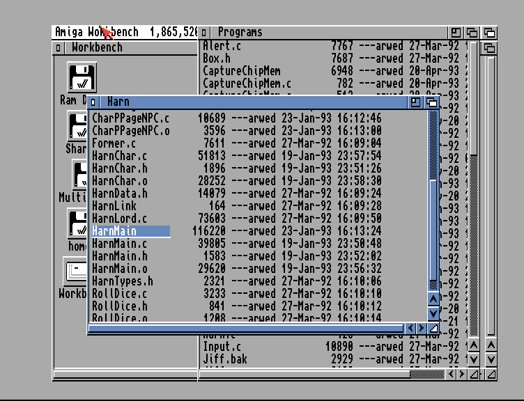

Loading a character (using custon rendered windowing system)

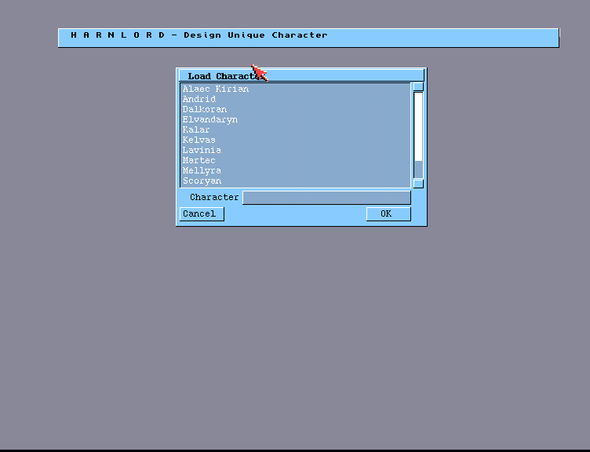

Character statistics

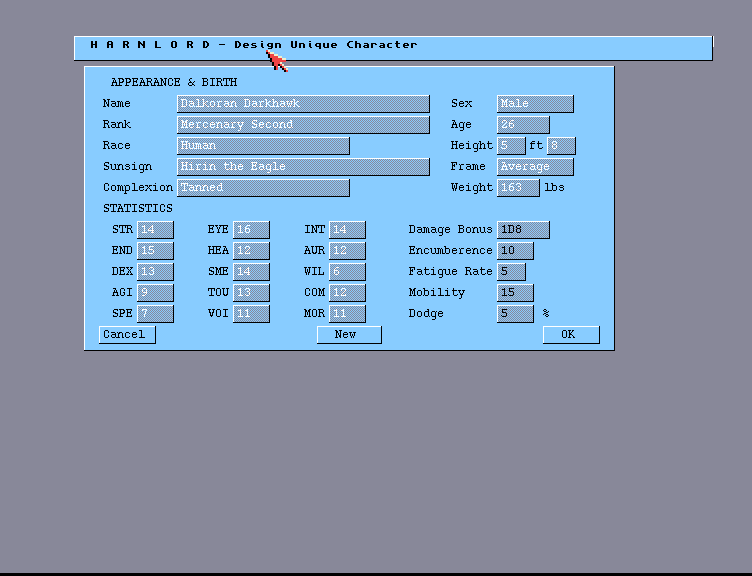

Character weapons

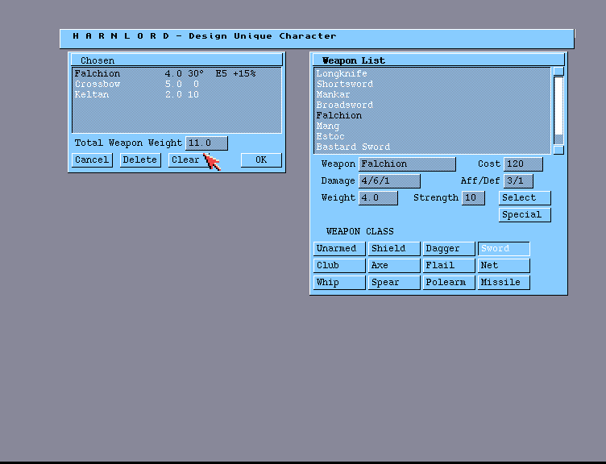

Original Save format
```
Dalkoran Darkhawk             
Mercenary Second              
                              
Human               
Male      
26   
Tanned         
  68   3 163   7
  12  14  15  13   9   7  16  12  14  13  11  14  12   6  12  11  12  12  12  12
1D8  
   0
   3   9   6   0
  21   5  15 300  58   0   0 100  16   0   0 100
   2   1   8   0 100   2   1  29   0 100   2   1  22   0 100   2   2  12   0 100   2   7  20   0 100   2   7   5   0 100   2   7  24   0 100   2   4  26   0 100   2   0  15   0 100
  87   5  15  92   6  10 129   6  -2   7   3   0  10   4   0  48   2   0
3
```

Loaded into WPF client.

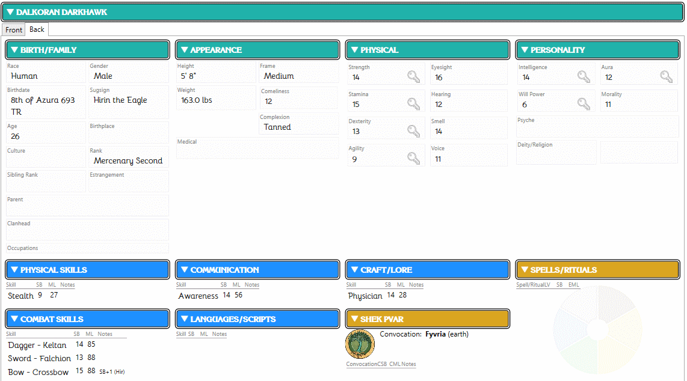
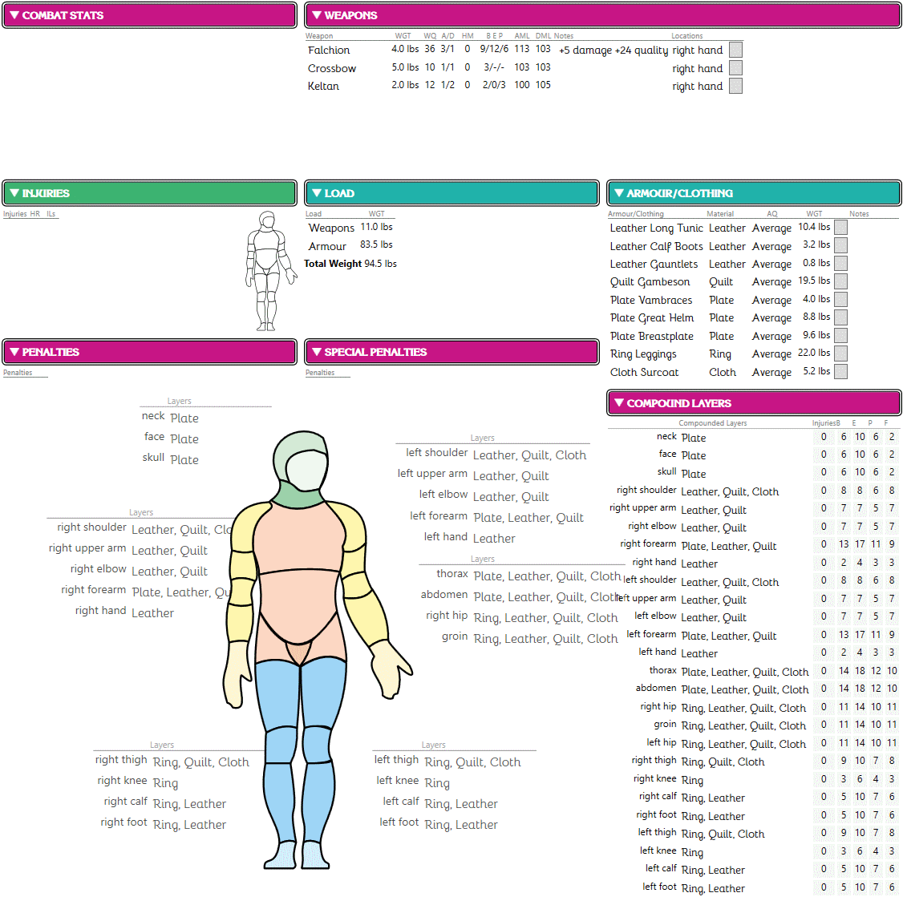

### Generate Random Characters

The random character generator will simulate dice rolls to generate a character based on the
HarnMaster v3 rules. The only input required is a name, race and culture. Everything else can be
randomly generated.

Below is the character generated as "Frey the Viking" using the following code:
```csharp
var character1 = this.CreateMockCharacter("Frey the Viking", human, culture: feudal);
```

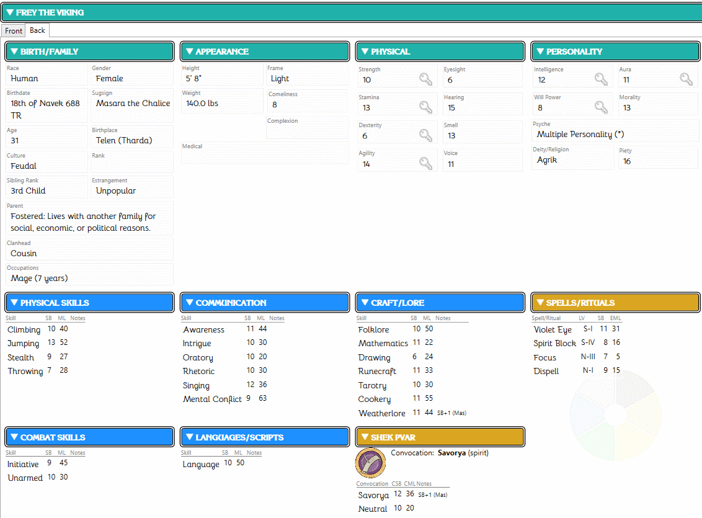
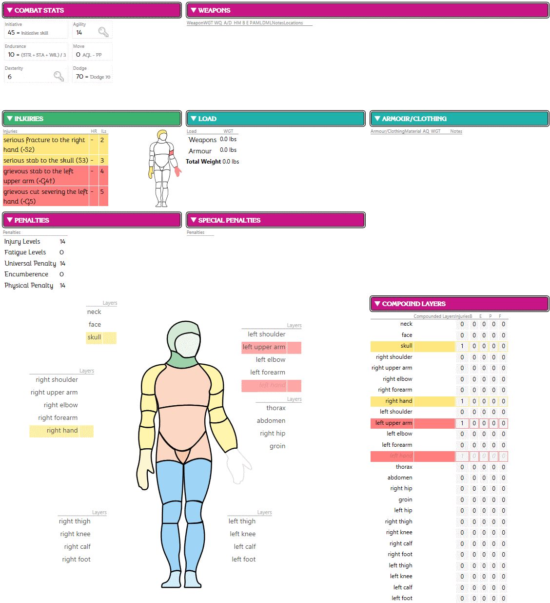

Note that tooltips provide details into the simulated dice rolls, together with any modifiers that
may have been applied. This is available for all character attributes and derived statistics.

The following example shows that Strength is considered to be a key attribute (hence the key icon).
According to an optional rule that is enabled for key attributes a player can roll four six sided dice
and discard the lowest value. So in this case the simulated rolls were 2, 4, 5 and 2. Discarding
one of the 2s gave a total of 11. Due to the characters low weight this is reduced by a point to
give a final value of 10.

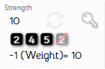

Skills in HarnMaster are calculated based on the average value of three character attributes.
They may then be modified due to sunsigns, or medical traits. In the example below the 
average of 10 is increased by 1 due to the character being born in the sign of Masara which
positively effects the Weatherlore skill.

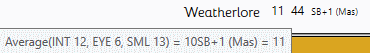

It's possible to review armour and weapons that are assigned, or to add, alter any existing ones.

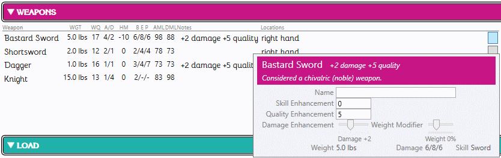

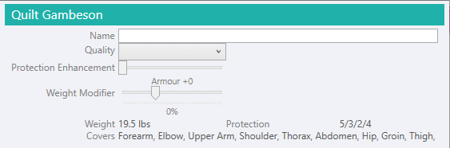

### Battle Simulation

The current test application generates seven characters, split into teams which then battle each other.
The teams and characters are:
* Team A
    * Frey the Viking - Axe, no armour
    * Sam of the Empire - Spear, boiled leather armour
    * Gail - Staff, no armour
    * Boris the Barbarian - Spear, no armour
* Team B
    * Knight - bastard sword, short sword, knight shield and plate armour
    * Gargun (Harn equivalent of a goblin/orc) - sword, no armour
* Team D
    * Dragon - bite, dragon scales

The HarnMaster combat rules are complex, with more gritty realism than most role playing systems.
Skills are D100 based, weapons have multiple strike capabilities (point, blunt, edge) and armour
has equivalent defensive values (in addition to fire/frost). Damage is inflicted to specific body locations,
each location has unqiue armour coverage and sensitivity to the various strike methods. There are
modifiers applied to skills based on injury, fatigue, encumberment, attack/defense position and
outnumbering to name a few.

The outcome of the combat is different each time (given all rolls are randomized). In this particular
instance Frey the Viking didn't survive. You can see from her character sheet that she suffered four
injuries, two serious and two grevious. The last injury which severed her left hand was fatal
(in HarnMaster a character can absorb no more than their endurance in injury levels).

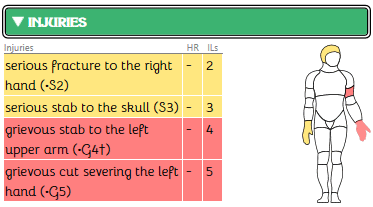

A full (very verbose) description of the battle can be seen in the output log. The following 
excerpt describes the end of the combat for Frey. Rather unchrivalrously the Knight attacks
Frey who is lying prone and in shock from her previous injuries.

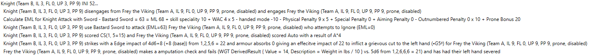

Unsuprisingly the Dragon ultimately wins the fight (despite using no breath weapon or magic)
and we can feel a little better seeing the Knight stumble to the ground and then be bitten in the face
by the Dragon.

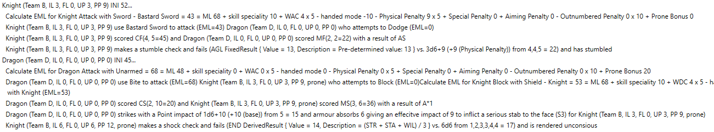

### Generate Characters using optional Character Point system

Rather than generating characters completely randomly, HarnMaster offers an optional 
point based system. A player can choose to assign a maximum number of character points
in order to select their desired attributes. There are two pools of assignable character points,
one that is applied to the base attributes (strength, dexterity, aura etc.), and the other that is applied to other characteristics
such as height, birthdate, profession etc.

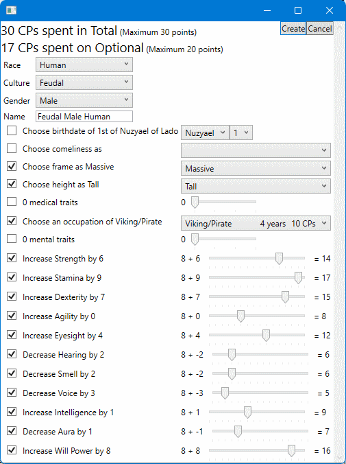

Attributes that were not selected to spend points on will be generated at random. So in
this scenario we have a human feudal male viking/pirate with mostly set attributes. Random
medical traits, psyche, comeliness and birthdate.

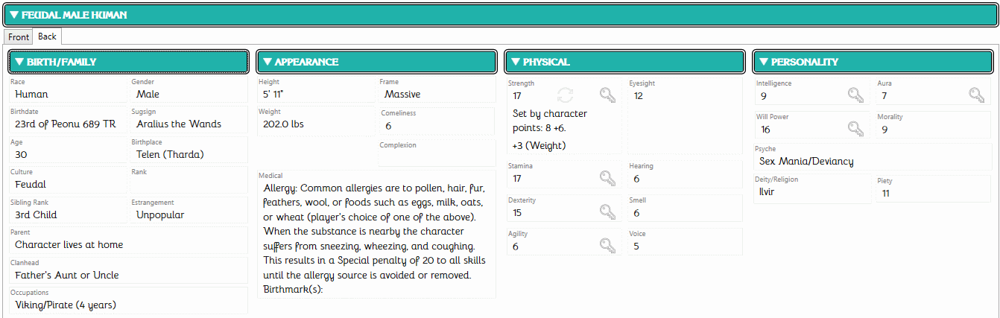

### Render Product Images (books) in 3D
These three dimensional renderings are a close representation of the real-world hardbacks.
The models were built by hand with correct relative proportions. The artwork uses copyrighted imagery
for the cover and Columbia Games logo, but everything else is rendered. All parts of the book
surfaces use DataTemplates to show titles, prefixes, suffixes, book numbers, tags, appendix details (back cover)
and a portion of the first page.

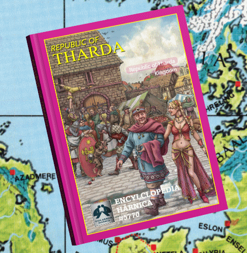
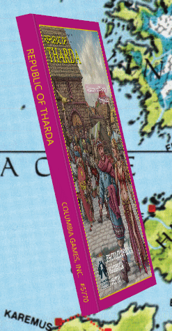
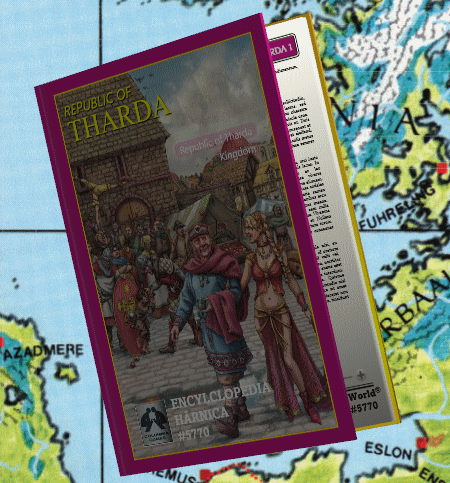
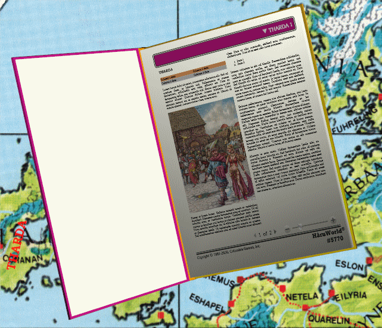
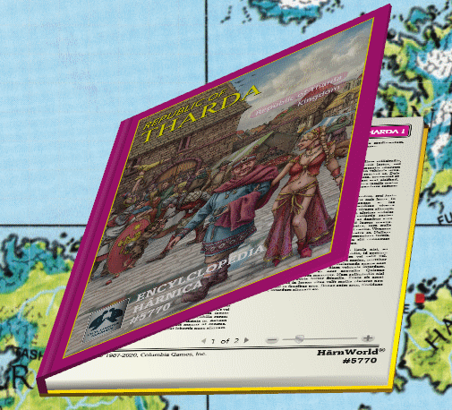

### Load/Save Game Rule Data from Files
All game data is currently hard-coded into the application. However, there is also an ability to
override the base data with revised/additional information. This means that new weapons, armour,
skills, spells, locations, star signs, etc. can be imported at startup via JSON files.

The full list of overridable data includes:
* Skills - name, attributes, signsign modifiers, opening mastery level
* Religions - name, description, min/max morality
* Healing tables for injuries by level and strike aspect
* Occupations - name, years required, character point cost, opening skills
* Convocations and spells
* Attack resolution tables - based on strike aspect vs. defense
* Injury resolution tables - severity vs. location
* Aiming zones
* Armour tables - quality, materials, garments, damage absorption vs. strike aspect, cost, weight
* Weapon talbes - quality, skill, damage per strike aspect, cost, weight, special types
* Sunsigns
* Birthplaces - for random generation

### Map Viewer
The Map Surface tab highlights two major features. The first is the list of game modules shown in a list on
the left side. Each module is a separately purchasable item available from Columbia Games. The modules
shown here are a subset of those I own (either as PDF or PDF and hard-copy). Double-clicking on a module will open it in the system's default PDF viewer.

The second feature is the map itself. The map starts by displaying the continent of Lythia between latitude
of 20 to 60 degress north on the world of Kethira. The map can be zoomed, and then also panned.

Tharda is a Republic on the remote island of Harn, off the west coast of Lythia.

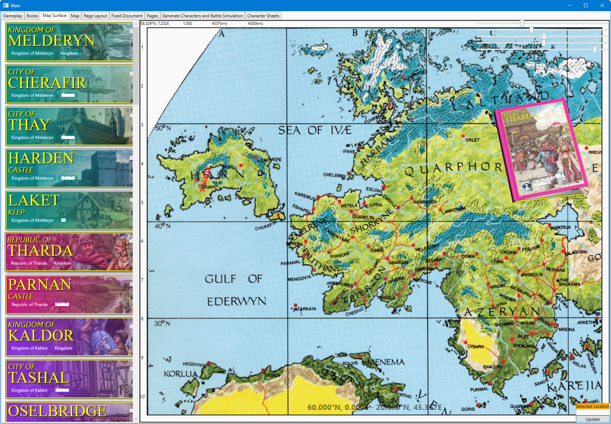

Map coordinates (Latitude and sort-of-Longitude) are translated to/from screen coordinates. The numbers
above the map show the mouse cursors current coordinates, the zoom factor and the width and height of the 
currently displayed map area in kilometres.

The bottom of the map shows the top/left and bottom/right coordinates in latitude and longitude.

It's worth nothings that he map surface isn't constrained to showing HarnWorld maps. Any maps for which
map layers and tiles can be created would work equally well.

<details>
<summary>A portion of the code used to define the Lythia map:</summary>

```csharp
public HarnMap(IEnumerable<IMapLocation>? locations = null)
    : base(new MapRectangle(new MapCoordinate(0, -60), new MapCoordinate(56, -20)), locations ?? Enumerable.Empty<IMapLocation>())
{
    this.AspectRatio = 447.0 / 433.0; // Harn map squares aren't quite square

    // A layer for the continent
    var lythiaMapLayer = new MapLayer("Lythia") { MinZoom = 0, MaxZoom = 2, ImagePath = "Images", Bounds = this.Bounds };
    lythiaMapLayer.MapTiles = new[] { new MapTile("Lythia", 0, -60, HarnDistance.FromLatitude(56m), HarnDistance.FromLatitude(40)) };
    this.Layers.Add(lythiaMapLayer);

    // Define the area in which the island of Harn is located
    var harnRegionBounds = new MapRectangle(0, -50, HarnDistance.FromLatitude(14m), HarnDistance.FromLatitude(10m));

    // The poetic map layer, a single image
    var poeticMapTile = new MapLayer("Poetic Map") { MinZoom = 0.5, MaxZoom = 2, ImagePath = "Images", Bounds = harnRegionBounds };
    poeticMapTile.MapTiles = new[] { new MapTile("HarnMap_Poetic", 0, -50.9, HarnDistance.FromLatitude(15m), HarnDistance.FromLatitude(11.3m)) };
    this.Layers.Add(poeticMapTile);

    // The famous hand-drawn Harn map, broken into 14 x 10 tiles, name 5001A_[A-N][1-10].[png|jpg]
    var artisticMapTilesLayer = new MapLayer("5001A Map Tiles") { MinZoom = 1, MaxZoom = 10, Bounds = harnRegionBounds };
    var mapTiles = new List<IMapReference>();
    for (var x = harnRegionBounds.TopLeft.Longitude; x < harnRegionBounds.BottomRight.Longitude; x++)
    {
        for (var y = harnRegionBounds.TopLeft.Latitude; y < harnRegionBounds.BottomRight.Longitude; y++)
        {
            mapTiles.Add(new MapTile("5001A", x, y, HarnDistance.FromLatitude(1m), HarnDistance.FromLatitude(1m)));
        }
    }
    artisticMapTilesLayer.MapTiles = mapTiles;
    this.Layers.Add(artisticMapTilesLayer);

    // The high fidelity contour "atlas" maps, broken into 14 x 10 tiles, name 5000_[A-N][1-10].[jpg|png]
    var atlasMapTilesLayer = new MapLayer("5000 Map Tiles") { MinZoom = 3, MaxZoom = 100, Bounds = harnRegionBounds };
    var atlasMapTiles = new List<IMapReference>();
    for (var x = harnRegionBounds.TopLeft.Longitude; x < harnRegionBounds.BottomRight.Longitude; x++)
    {
        for (var y = harnRegionBounds.TopLeft.Latitude; y < harnRegionBounds.BottomRight.Longitude; y++)
        {
            atlasMapTiles.Add(new MapTile("5000", x, y, HarnDistance.FromLatitude(1m), HarnDistance.FromLatitude(1m)));
        }
    }
    atlasMapTilesLayer.MapTiles = atlasMapTiles;
    this.Layers.Add(atlasMapTilesLayer);
```
</details>

#### Map Tiling/Layers
The map is constructed of a number of layers. Each layer represents a specific zoom range and has associated
map "tiles". At the very highest level there is a single tile for the continent (maximum visible area). At higher zoom
levels the map is broken into tiles (roughly 100km squares). There is a transition from one layer to the next where
the opacity of one layer in increased and the other decreased. This makes zooming between layers quite fluid.

Here is a tile from the Harn map.

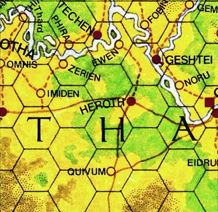

This is the corresponding tile from the next layer down. Note that in this case there is a single tile at each layer
but generally the expectation would be to have more tiles as the zoom increases.

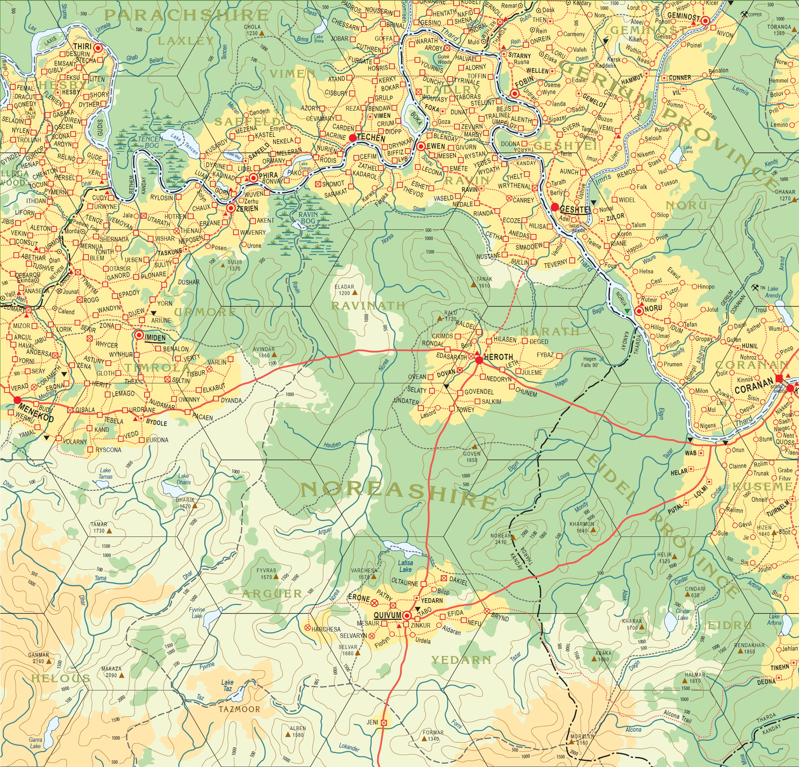

This would be the run-time generated "blend" between the two maps

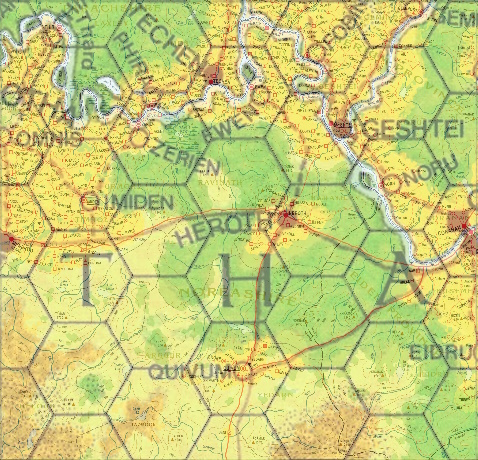

Another shot here shows the top edge of the Harn map focused on the castle at Leriel, 
the blurry section above is from the continent level map.

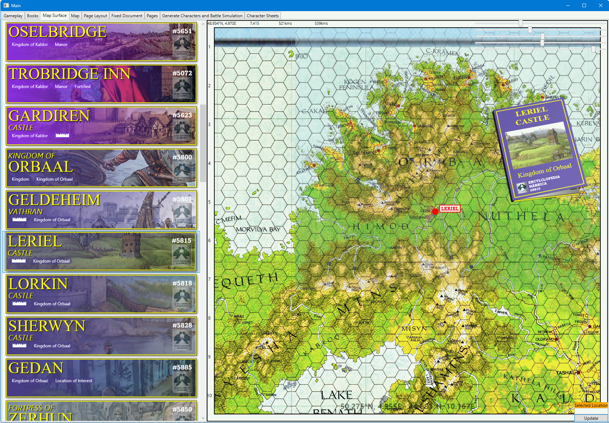

In this shot you can see that high fidelity maps are available only for a portion of the map. The bottom
left area retains the higher layer imagery.

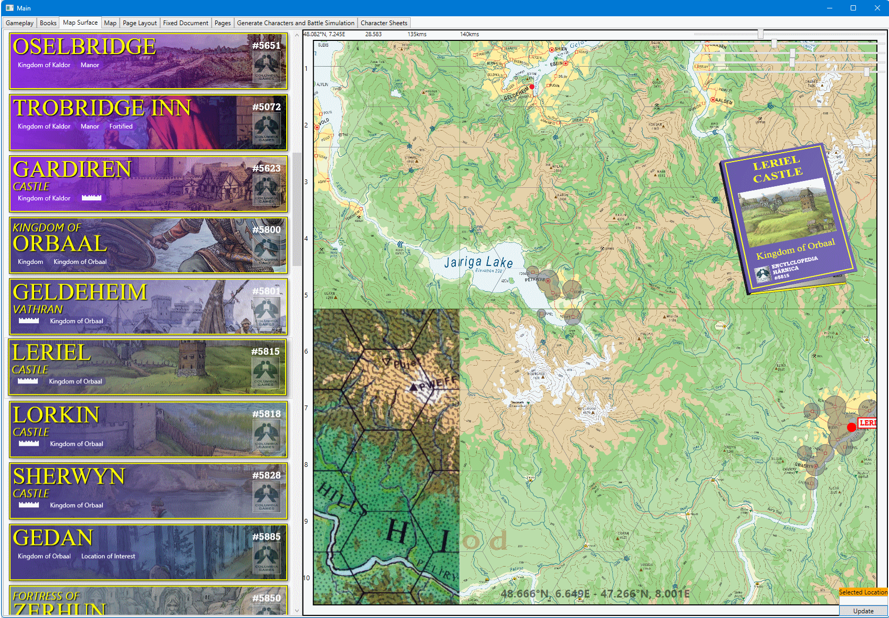

#### Map Zooming
The map is zoomed in and out by scrolling using the mouse wheel, or for a touch screen device 
pinch to zoom is also enabled.

Here we see Tharda more clearly defined as an area on Harn's western side.

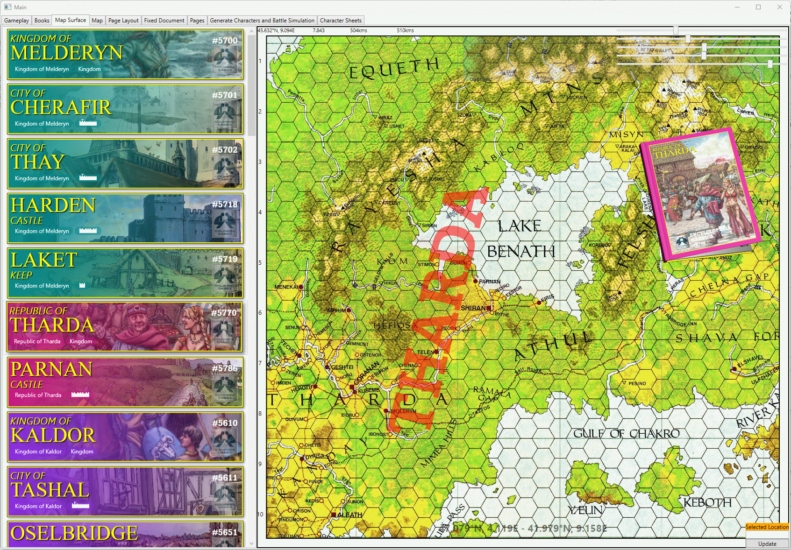

Zooming further we see the two map layers blending together.

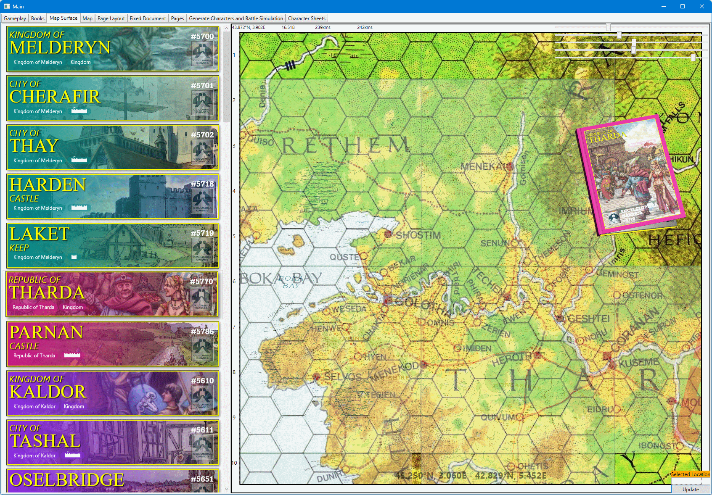

Until we get down to the highest fidelity maps.

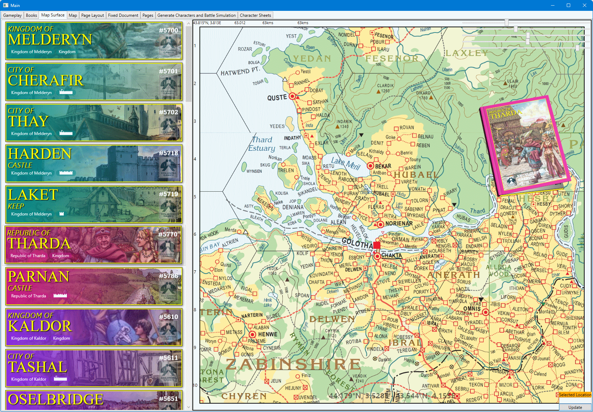

#### Map Panning
The map can be panned in any direction by holding the left mouse button (or touch finger) and
moving.

#### Map Location Overlays
Map locations can be highlighted by either selecting the corresponding module from the left
list, or by single clicking (tapping) the location on the map. When zoomed out the map will select
the highest populated location in the nearest vicinity of the click.

When clicking on a location that has full settlement details loaded in addition to rendering the
name of the settlement in a red bordered box the map will also render a circle whose size is
determined by the settlements population. If the selected settlement is held by a clan/house to
which other settlements owe fealty then those settlements will also be rendered with their population
circles.

In the example below Geldeheim is the royal seat of the Kindgom of Orbaal. As such all settements
in the Kingdom owe fealty to that clan. The various colours represent the great clans within the
Kingdom.

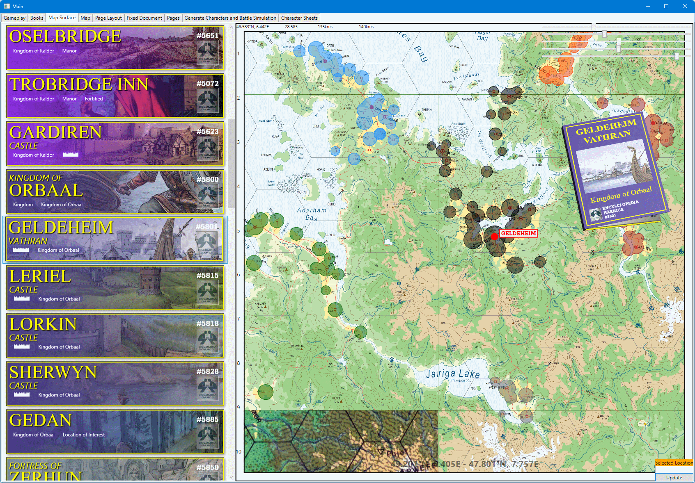

In this example Quiam is a much smaller settlement than Geldeheim. Only three small manors owe
fealty to that clan and are highlighted here. The nearby seat of Tandir is the head of the great clan
to which Quiam is aligned with. At the bottom left of the screen you can see full details for the
manor/township of Quiam.

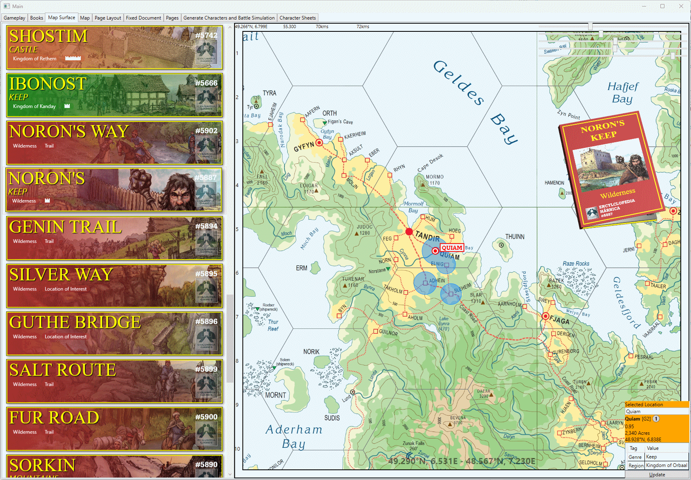

#### Map Route Overlays
Several of the modules represent major trade routes across the island of Harn. When selecting those
modules the trade route will be displayed as a dashed line. Major settlements along the route will also
be highlighted.

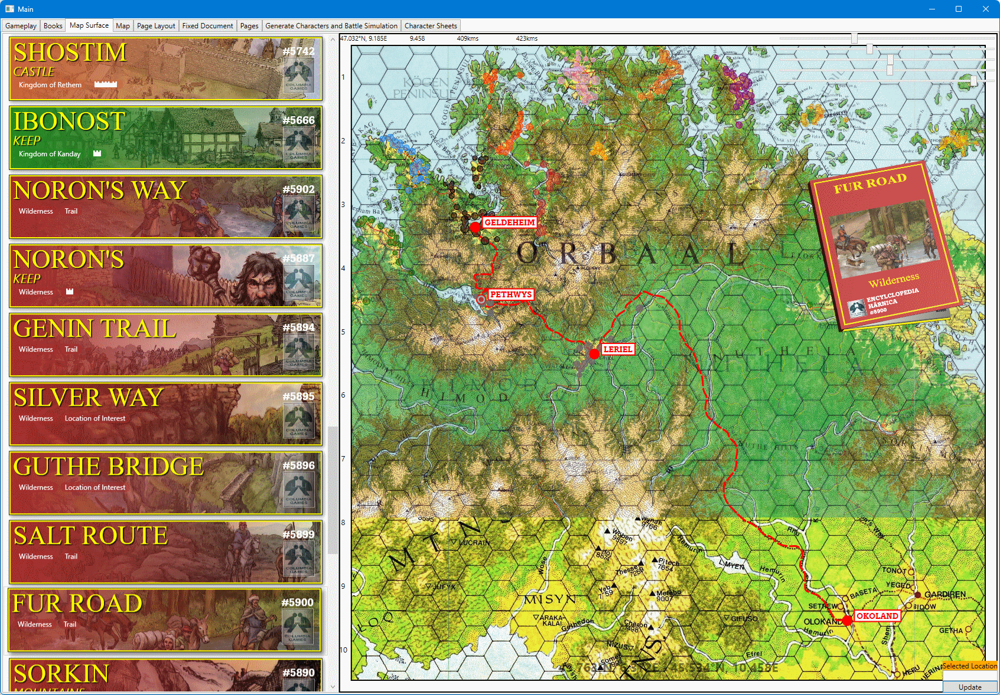
