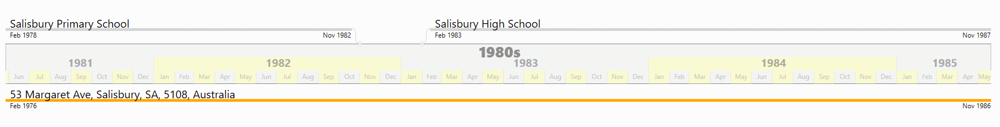

# TimeLife
This project was partly inspired by a desire to have another go at writing an optimized virtual canvas, and partly by the idea of laying out events along the timeline representing a life.

## Spencen.TimeLife.Core
Platform independent model for the timeline.
At the core is the `ITimelineEvent` interface:
```csharp
    public interface ITimelineEvent
    {
        string Description { get; }
        DateTimeOffset EventDateTime { get; }
        IEnumerable<string> Tags { get; }
    }
```
Also the `ITimelineSource` interface which is used to allow optimized access into the underlying collection of events. 
The implementation of this interface is built with performance in mind, with the assumption that we may have 100,000+ `ITimelineEvent`s.
```csharp
    public interface ITimelineSource
    {
        ITimelineEvent this[int index] { get;}
        IEnumerable<ITimelineEvent> GetEventsInRange(DateRange range, Func<DateTime, DateTime> dateIncrement);
        IEnumerable<(ITimelineEvent TimelineEvent, int Index)> GetEventsInRange(DateRange range);
        int IndexOf(DateTime dateTime);
        int Count { get; }
        IEnumerable<ITimelineScale> AvailableScales { get; }
        void SetRange(ITimelineScale scale);
    }
```

## Spencen.TimeLife.DataService
Used to load timeline events from a data-source(MySQL database). The database was populated from scanning several  folders to extract photo, video and document metadata.
These media references can then be used as a datasource by the timeline.

## Spencen.TimeLine.Client.WPF
A standalone WPF application that uses two custom built controls to render a timeline. The application is intended as a test harness for the actual controls, there is very little
actual functionality/use.

Showing timeline events with a duration. The timeline shows three time scales of increasing fidelity. 
In this case we have centuries, decades and years as we are showing a period of 20 years.


Hovering the mouse over the timeline shows a scrollbar. In this example the scrollbar shows all the years
available timeline, and the scroll thumb highlights the years currently shown. Moving the thumb scrolls the date range displayed.


Zooming in to show months within the years. The time scales automatically adjust, in this case the three levels
are now decades, years and months.



Zooming out to show centuries and decades.


Scrolling the timeline to a date that show digital assets (post 1985). Assets are grouped by day, and the timeline
shows as many as will fit within the vertical space allocated to the control.


### CalendarBar
* The control is a `CalendarBar` inheriting from `Control` and implementing `IScrollInfo`.
* `CalendarBar` has three custom properties
    * MinimumDate
    * MaximumDate
    * Scale
* The three time scales within the bar are rendered directly using OnRender method.

### TimelinePanel
* The TimelineEvents are shown using a custom templated `ItemsControl` that uses the `TimelinePanel`
as its ItemsHost.
```xml
<controls:TimelinePanel x:Name="Panel"
    TimeScale="{StaticResource TimeScale}"
    IsItemsHost="True"
```
* The control is designed to layout child elements based on a value that they expose via an attached property
(not disimilar to the attached properties used by Grid or Canvas).
* Important to note that the children are rendered based on the supplied ItemTemplate or ItemTemplateSelctor
as per any other ItemsControl (or derivative). The lines that attach the child item to the `CalendarBar`
are _not_ part of the child template, they are rendered directly onto the surface of the `TimelinePanel`
within its `OnRender` method.
* The `TimelinePanel` uses a combination of dependency properties - normal, read-only and attached
to achieve the desired behavior.
    * __MinimumValue__ - represents the minimum of the range to be displayed, this is a double since the control isn't limited to date ranges
    * __MaximumValue__ - represents the maximum of the range to be displayed, this is also a double
    * __ChildPadding__ - minimum space between child elements
    * __BaseLineVerticalAlignment__ - whether the Calendar bar will be shown at the top, bottom or centered
    * __Scale__ - the zoom factor applied
    * __FixChildOffset__ - whether a child's position should be retained when scrolling
    * Attached Properties
        * __TimelineValue__ - the value set on a child that determines its placement, should be between the Minimum and Maximum Values.
        * __ConnectorBrush__ - brush used to render lines
        * __ConnectorThickness__ - thickness of render lines
        * __ConnectorLead__ - allows for splined connector lines, set a lead of zero for a vertical connector
## Dependencies
These project have a dependency on:
* __Spencen.Common__
* __Spencen.Common.Calendar__
* __Spencen.Common.UI__, a UI agnostic library for common concerns such as view model base classes, converters etc.
