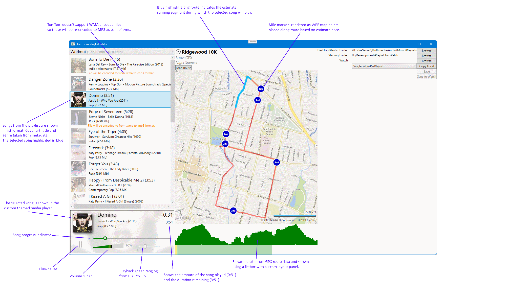

# TomTom Playlist Editor
Allows a playlist stored on your windows machine to be exported to a TomTom device (e.g. runner watch).

It supports the follow two playlist formats:
* .M3U - MultiMedia Playlist
* .WPL - Windows Playlist

This tool  bypasses the software provided by TomTom itself and will write directly to the USB device on your watch.
I will update the master playlist (list of playlists), and copy playlists from your windows device onto the watch.
It will then immediately be available on the TomTom device.

This allows you to managed playlists on your Windows machine (much easier than interface provided by TomTom)
and simply export to your device when ready. You can also view how that playlist will work with any given route.
The route will be displayed on a map, showing mile markers and elevation. Clicking each song on the playlist will
show you the estimated start and end position on your run that the song will play. Obviously this depends on how
fast you run on the day, but it will use the average pace you program.

Clearly this is not a finished product, and I've since migrated to Garmin ecosystem (watches) so no longer have a need
for the export feature. I do still occassionally use the map feature though, especially for a shorter race where I want to 
align the music tracks to my expected goal markers.

